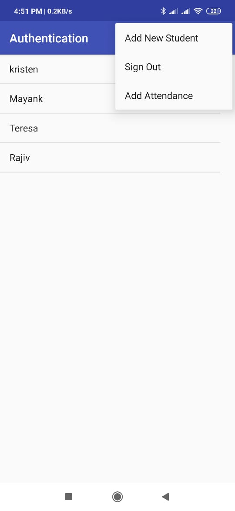

# StudentDatabase
It is a user-authenticated mobile application that allows the user to maintain records of students along with their details like name ,school name ,age ,subejcts studied ,etc. 
This application uses firebase to maintain realtime database.User can add new students to the databse, delete the existing ones after long pressing the name in the listview and
also view the student details on single click on the listview.

